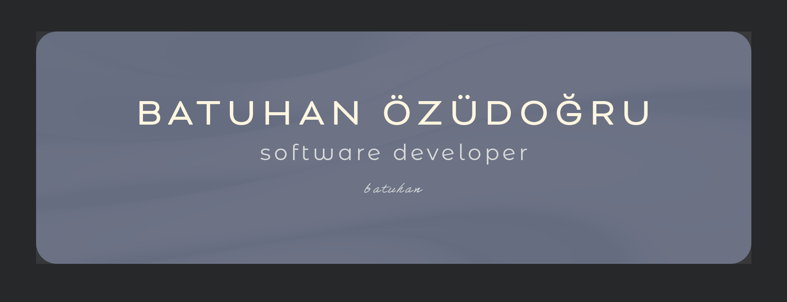

###

###

My fundamental motivation for stepping into the software industry was my vision of improving the paper-and-pencil processes I encountered during internships in civil engineering by leveraging modern technologies. 

With this vision in mind, I took my first steps into the world of software. During my military service as a reserve officer after graduation, I found myself in an environment where I had to adopt a disciplined approach. 

The discipline and analytical thinking skills I gained from both the military and engineering enabled me to adapt quickly to the software world and approach problems systematically. 

By participating in Patika+'s Full-Stack Web Developer program, I gained experience in technologies such as Java, Spring Boot, JavaScript, and React. 

My goal is to become a part of the information technology field, which has become a vital part of many sectors today, and to develop products and solutions that enhance human life with the knowledge I have gained in this field.

###

  

###

  

